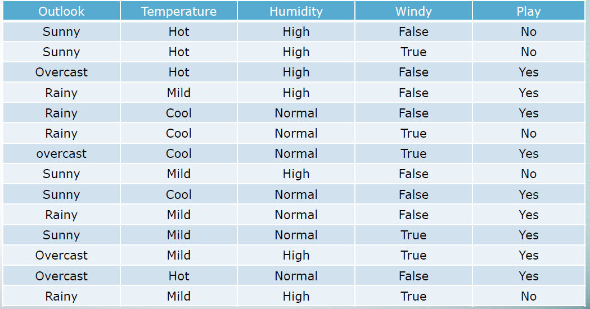
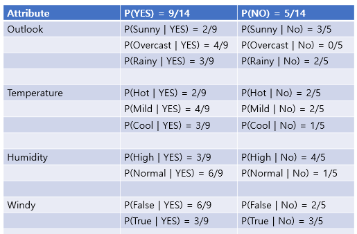
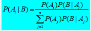
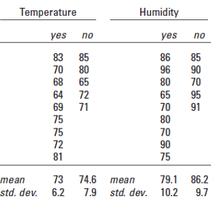
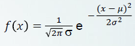

## Statistical Modeling

### Bayes' Rule

#### Nominal

weatherdomain을 살펴보자.

각각의 attribute의 probablity 값을 class의 yes no 기준으로 나눠 보자!!

이렇게 나뉜다.

New Instance

ex) Outlook = Rainy , Temperature = Mild , Humidity = Normal , Windy = False

이렇게 new Instance가 들어온다면 class의 값을 구해보자!

Likelihood of YES = 9/14(YES) * 3/9(Rainy and YES) * 4/9(Mild and YES) * 6/9(Normal and YES) * 6/9(False and YES)

= 0.04

Likelihood of NO = 5/14(NO) * 2/5(Rainy and NO) * 2/5(Mild and NO) * 1/5(Normal and NO) * 2/5(False and NO)

= 0.004

이제 이 식에 대입해보자.

P(YES | E) = 0.04 / (0.04 + 0.004) = 0.91

P(NO | E) = 0.004 / (0.04 + 0.004) = 0.09

여기서 Sigma j=1부터 n까지라는 뜻은 class의 모든 값의 합이다.

> 여기서는 Play = YES or NO

따라서 분모는 Likelihood of YES(0.04) + Likelihood of NO(0.004) 가 된다. 

-> Nominal 값이 더 있다면 더 추가가 됐겠죠!?

class의 모든 값의 합이기 때문에 P(YES | E) + P(NO | E) = 1 이 된다. (모든 경우의 수니까)

따라서 new Instance의 대한 recommendation 은 YES(91.0%)가 나오게 된다.

#### Numeric

이산값이 어려웠다...

weatherdomain의 numeric 값을 보자.

.PNG)

이렇게 있는데

numeric 값의 평균과 표준 편차를 구해야 한다.

mean = 평균

std.dev = 표준 편차

표준 편차의 ^2 = 분산

이렇게 구하고

이 식에 집어 넣어야 한다!!

Likelihood of YES

시그마 값 = 표준 편차(6.2)

e = 자연로그의 밑

파이 = 3.14xxxx

x = new Instance의 numeric한 값

뮤 = 평균(73)

다 대입해서 Nomianl 처럼 값을 다 구해주면 된다.

~~~

New Instance

outlook = sunny, temperature = 72, humidity = 80, windy = true then play = ?

구해보자!!

Likelihood of yes

-> 9/14 * 2/9 * 1.02293 * 1.0087 * 3/9 = 0.0491347

Likelihood of no

-> 5/14 * 3/5 * 1.11354 * 1.56451 * 3/5 = 0.22399

P(YES | E) = 0.0491347 / (0.0491347 + 0.22399) = 0.18

P(NO | E) = 0.22399 / (0.0491347 + 0.22399) = 0.82

따라서 New Instance 의 recommendation = "No" (82%) !!!

~~~
