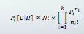
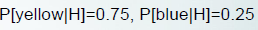

## Bayesian models for document classification

each instance = a doucument

intstance's class = the document's topic

document classification

각 단어에 대해 추가하거나 삭제한다.

> ex) beautiful -> beau, pf -> professor

document = 단어의 가방이라고 볼 수 있다.

각각의 document의 길이는 다 다를 수 있는데

다 같다고 가정을 한다.

  

이 식을 보자

Pi = 각 단어들의 확률

E = document

H = 범주중의 하나

Ni = i 인덱스에 대한 확률

document topic 에 대한 probability 중에서 가장 큰 값을 가지는 것을 선택

예를 들어보자.

document topic 에 'yellow' 와 'blue'가 있다고 가정하자.

class H에서는

  

의 값을 가진다.

document E = {blue, yellow, blue} 

길이 N = 3

이 3단어의 경우의 수를 살펴보자.

> 순서는 상관없다

~~~

{blue, blue, blue} = 3! * (0.75)^0/0! * (0.25^3)/3!

{yellow, yellow, yellow} = 3! * (0.75^3)/3! * (0.25^0)/0!

{blue, yellow, yellow} = 3! * (0.75^2)/2! * (0.25^1)/1!

{blue, blue, yellow} = 3! * (0.75^1)/1! * (0.25^2)/2! = 14%

~~~

이 4가지의 경우의 수가 나온다.

각각의 확률은 위의 식을 계산하면 나온다.

class H 에서 {blue yellow blue} = 14%

이제 class H' 를 보자

  

~~~

{blue, blue, blue} = 3! * (0.1)^0/0! * (0.9^3)/3!

{yellow, yellow, yellow} = 3! * (0.1^3)/3! * (0.9^0)/0!

{blue, yellow, yellow} = 3! * (0.1^2)/2! * (0.9^1)/1!

{blue, blue, yellow} = 3! * (0.1^1)/1! * (0.9^2)/2! = 24.3%

~~~

이런 확률이 나오게 된다.

{blue, blue, yellow} 경우에는

h = 14%

h' = 24.3%

이기 때문에 h' 범주에 속한다.

왜? h' 의 %가 더 높게 나왔기 때문이다.

### ZeroR

ZeroR은 다수의 클래스 값으로 new instance를 예측하는 것이다.

weather domain 에서 yes가 9번, no가 5번 나왔다.

따라서 new instance에 대해서 yes로 recommendation을 하게 된다.

#### confusion matrix

~~~
Tp Fn   9 0
      =
Fp Tn   5 0
~~~

Tp = instance에 대한 recommendation이 yes 인데 yes (True and positive)

Fn = instance에 대한 recommendation이 yes 인데 no (False and negative)

Fp = instance에 대한 recommendation이 no 인데 yes (False and positive)

Tn = instance에 대한 recommendation이 no 인데 no (True and negative)

##### 정확도(accuracy)

recommendation 이 얼마나 정확한지!

위의 confusion matrix 에서는

9/ 14 (올바른 recommendation / 전체 recommendation)

##### 정밀도(precision)

Yes에 대한 것 = 9/14 (yes의 맞는 개수/ 전체 yes의 개수)

> Tp/(Tp + Fp)

No에 대한 것 = 0/0 (no의 맞는 개수 / 전체 no의 개수)

> Tn/(Fn + Tn)

세로!!!

##### 재현율(recall)

Yes에 관한 것 = 9/9 (yes가 나와야 하는 yes의 개수 / 전체 yes가 나와야 하는 것의 개수)

> Tp /(Tp + Fn)

No에 관한 것 = 0/5 (no가 나와야 하는 no의 개수 / 전체 no가 나와야 하는 것의 개수)

> Fn/(Fn + Fp)

가로!!
