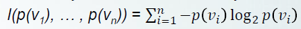
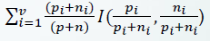
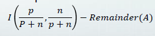

## Decision tree

- 기계학습 알고리즘에 잘 맞는 방식 (다른 rule 보다)

- 효과적인 알고리즘

- 불확실성을 처리하기 위한 방법론

- divide and conquer

~~~
예를 들어 보자

attribute outlook에 대해서 nominal data의 대한 값들이 

sunny = {yes,yes,no,no,no}

overcast = {yes,yes,yes,yes}

rainy = {yes,yes,yes,no,no}

이렇게 있다고 가정 하자.

outlook overcast = yes 로 더 이상 나눌것이 없다.

-> Done! (conquered!)
~~~

- decision tree의 root는 정보 분류 능력이 가장 좋은 것으로 선정!

- entropy가 낮으면 정보 분류 능력이 높다!

- entropy가 높으면 정보 분류 능력이 낮다!

### Information

- informaion = 정보의 bit 함유량

- [0...1] 의 구간 값을 가진다

- 0은 더 이상 분류가 필요 없는 것 (전체가 conquer!!)

- 1은 정보 분류 능력이 하나도 없는 것

구하는 식

  

이다!!

weather domain 에서 play(class)의 값은 yes or no 밖에 없기 때문에 n = 2

yes = 9/14

no = 5/14

따라서 I(p/(p+n), n/(p+n)) = I(9/14, 5/14)

  

의 값이 된다.

#### Remainder

- 나눈 후에 더 나눠야 하는 것들에 대한 bit 요구량

  

이 식에 대입한다!!
~~~
sunny   yes,no    overcast  yes  no    rainy     yes  no
5/14 * I(2/5,3/5) + 4/14 * I(4/4,0/4) + 5/14 * I(3/5,2/5)
~~~

#### Gain

- original informaion 요구량과 새로운 요구량의 차이!

- 음수가 될 수 없다

- 1을 넘을 수 없다

  

이중에서 가장 gain이 큰 attribute를 고른다!!! 

> 왜? 정보 분류 능력이 가장 큰 것이기 때문이다

Gain이 크다는 뜻은 Remainder가 작다는 뜻이다.

따라서 Gain이 가장 클 때의 attribute를 고르면 정보 분류 능력이 가장 큰 것이다.

