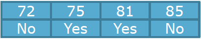

## Decision tree

정보 분류 능력이 좋은것을 찾기 위해 Gain 계산!

Gain이 높으면 정보 분류 능력이 높은 것!

왜?  remainder(남은 것)이 작기 때문에!

> Gain = original information - remainder

### Numeric

- A two-way or binary split

이분으로 나누자!!

 

이런 데이터가 있을때

72~75 의 가운데 값 = 73.5 (break point)

75~81 의 가운데 값 = 78 (break point)

81~85 의 가운데 값 = 83 (break point)

계산해보자!

일단 기존의 information 값

    yes   no
= I(2/4, 2/4) = 1

73.5 을 기준

num of data(left)    yes  no        num of data(right)     yes  no
   1/4   *         I(0/1,1/1) +           3/4          * I(2/3,1/3) = 0.689

기존의 informaion 값에서 빼주면

1 - 0.689 = 0.311

78 을 기준

2/4 * I(1/2,1/2) + 2/4 * I(1/2,1/2) = 1

1 - 1 = 0

83 을 기준

3/4 * I(2/3,1/3) + 1/4 * I(0/1,1/1) = 0.689

1 - 0.689 = 0.311

이중에 Gain 값이 가장 큰 것을 고른다!

예제를 temperature의 numeric 값이라고 해보자

sunny의 데이터에 대한 remainer라고 생각하고

73.5를 기준으로 식을 세워보면

if outlook = sunny and if temperature >= 73.5 then play = no

if outlook = sunny and if temperature < 73.5 then play = yes

의 식이 나온다.

