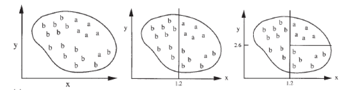
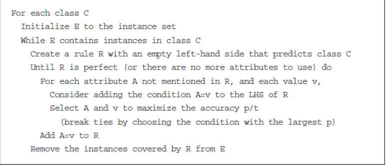
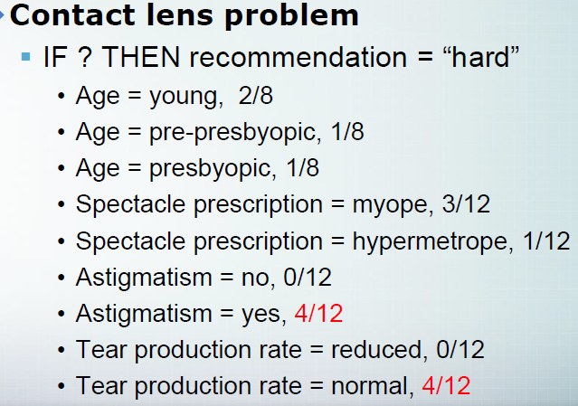
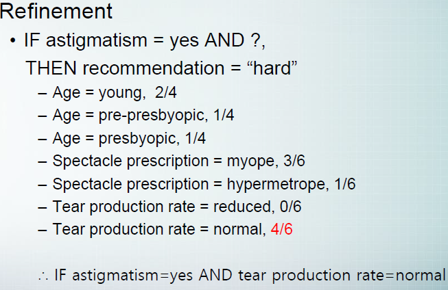

# Covering algorithm

분류 능력을 최대화 시키자!

1. 가능한 많은 같은 Instance들을 포함하게!!!

2. 가능한 다른 Instance들을 배척하게!!

 

처음에 나눴을 때 오른쪽에 아직 b가 많이 남아 있습니다.

두 번째에 1번,2번을 적용하여 최대한 같은 Instance가 포함되게 나누고, 최대한 다른 Instance를 배척하였습니다

Decision Tree = Instance에 대한 속성, 속성값에 집중

Covering algorithm = 각각의 class에 집중!!

 

이제부터 weather domain 기준으로 보자!!

각각의 class C (ex. play=yes) 에 대해

E 를 Instance set으로 초기화 한다

E = 9개의 yes (weather domain -> yes = 9, no = 5)

왼쪽 condition을(LHS) empty로 두고 기본적인 rule을 만들자

if (empty), then "play = yes"

이 룰을 완성시켜보자.

R이 완전해질 때까지 각각의 attribute A의 value 에 대해 (아직 언급되지 않은) 반복!!

ex) outlook attribute가 나왔다면 그 다음 조건문에는 outlook을 제외!

p/t가 가장 큰 값을 고른다.

> p(positive examples) / t(instances)

만약 둘의 값이 같다면 p가 큰 것으로 고른다!

> 2/4 = 4/8 인데 p가 4가 더 크기 때문에 4/8 선택!

조건이 완성되면 E에서 그에 맞는 것을 지운다!

만약 1,2,3,4,5,6 번째 Instance가 yes라면

E = 1,2,3,4,5,6

조건문에 맞는 E = 1,2,3,4

then E = 5,6

하지만 6개의 Instance를 다 찾지 않았으므로 나머지 5,6을 찾을때 까지 반복

Contact lens 를 보자

  

recommendation = "hard" 인 것 중에

Age = young = 2/8 (young의 hard 개수 / young의 recommendation 개수)

이렇게 p/t 를 구한 후에 가장 큰 값을 고른다.

  

다음 단계에서 astigmatism = yes 를 제외한 instance에서 고른다

Age = young = 2/4 (young의 astigmatism = yes를 제외한 hard의 개수 / young의 astigmatism = yes를 제외한 개수)

이 과정을 perfect 해지기 전 까지 반복한다.

## Rules vs Trees

Tree = attribute의 정부 분류의 집중 (Class 값을 우선적으로 생각하진 않는다)

Rule = 특정 Class의 맞는 Rule을 선택한다. (Rule의 순서를 지정할 수 없다.)
