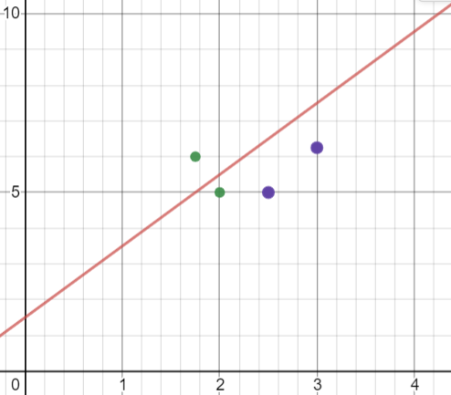
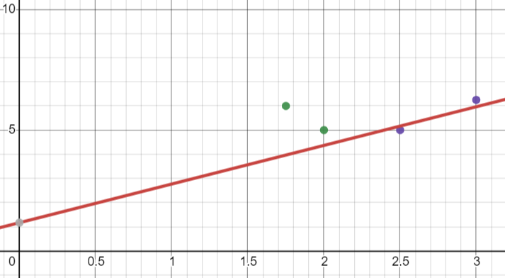

## Association rules

Item = 속성과 속성값

~~~
In weather domain

3개의 Item set

Humidity = normal, Windy = false, Play = yes

7 potential rules

If humidity = normal and windy false, **then** play = yes (4/4)
If humidity = normal and play = yes, **then** windy = false (4/6)
If windy = false and play = yes, **then** humidity = normal (4/6)
If windy = false, **then** humidity = normal and play = yes (4/8)
If humidity = normal, **then** windy false and play = yes (4/7)
If play = yes, **then** humidity = normal and windy = false (4/9)
If - , **then** humidity = normal and windy = false and play = yes (4/14)

~~~

- : Headless rule

Coverage = 4개 

-> Humidity = normal, Windy = false, Play = yes 인 것이 4개

Item set 이 2개라면?

-> 3개의 Potential rule

## Linear model

- 선형 회기 분석

각각의 attribute의 weight 값과 실질값

각각의 attribute가 numeric이고, class도 numeric 이면 가장 가까운 함수를 어떻게 정할까?!

-> 거리에 대한 차이가 가장 적은 것으로

단점 : 선형적

-> 곡선으로 그으면 되는데 직선으로 오차가 가장 적은 쪽으로 긋기 때문에 단점

~~~

1.0 * Height + (-2.0 * Girth) >= 1.5

-> 1.0 * Height >= 1.5 + 2.0 * Girth

N = 0.04

Instance (Girth, Height) = {(1.75, 6.0) (2.0, 5.0), (2.5, 5.0), (3.0, 6.25)}
Positives = {(1.75, 6.0), (2.0, 5.0)}
Negatives = {(2.5, 5.0), (3.0, 6.25)}

이를 표로 나타내보자!

 

X축 = Girth

Y축 = Height

Linear = (1 * Hegit >= 1.5 + 2.0 * Girth)

Num   Girth   Height   Class   Color
1     1.75    6        p       Green
2     2.0     5        p       Green
3     2.5     5        n       Purple
4     3.0     6.25     n       Purple

식에 적용해보면, 2번 Instance가 맞지 않다.

따라서, 2번 Instance를 통해 Linear를 옮겨보자!

w for threshold = 0.04 * 1.0 = 0.04

w for Girth = 0.04 * 2.0 = 0.08

w for Height = 0.04 * 5.0 = 0.2

Linear에 더하자!

1.0 * Height + (-2.0 * Girth) >= 1.5

-> 1.2 * Height + (-1.92 * Girth) >= 1.54

 

이렇게 되면 또 1개의 Negative 가 오류!

이에 대해 아까 위의 과정을 반복하여, 모든 Instance가 제대로 된 값을 가지면 중단!

N = 0.04로 잡은 이유는 0.4는 너무 크게 움직이고, 0.004는 너무 조금 움직여서 그런다고 한다. 
