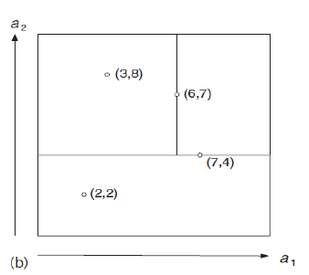
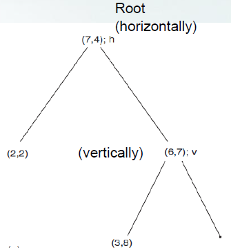
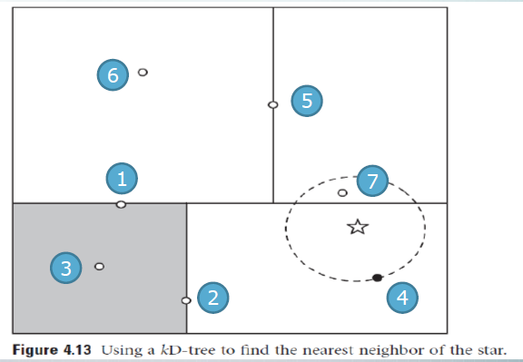
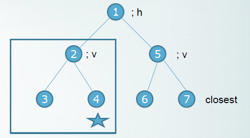
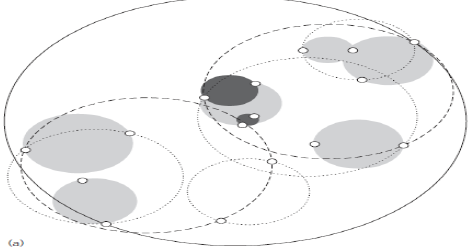

# Instance-based learning

weather domain 에서

first instance = sunny,85,85,false,no

new instance = sunny,70,80,true

이 둘의 거리는(In humidity)?

~~~

humidity 에서 min 값 = 65, max 값 = 95

((70 - 65) / (95 - 65) - (85 - 65) / (95 - 65))

~~~

이 각각의 attribute의 값들을 다 더한 후에

root를 씌어주면 거리가 계산이 된다!

각각의 Instance에 대해 값을 다 계산하고

그 중에 가장 작은 값을 recommend 해주게 된다!

그러면 생각할 수 있다.

Instance based rule은 너무 비효율적이지 않은가?

#### 그래서 나온 kD-tree!!

 

이런식으로 나타낼 수 있다.

트리로 나타낸다면?

 

이렇게 나온다!!

여기서 알아두어야 할 것.

수평으로 긋는다면, 다음에는 무조건 수직!!

수직으로 긋는다면, 다음에는 무조건 수평!!

이렇게 번갈아가면서 그으면 된다.

~~~

New Instance = (9,5)

1. 루트(7,4)가 수평으로 되어 있기 때문에

y를 기준으로 비교를 해준다.

5 < 4 = 위쪽 (트리로는 오른쪽)

2. 부분 트리의 루트(6,7)가 수직으로 되어 있기 때문에

x를 기준으로 비교를 해준다.

9 > 7 = 오른쪽 (트리로 오른쪽)

~~~

하지만 이 kD-tree 에서도 문제점 발생!!

 

2번째 영역에 있는 Instance(7번)와 더 가깝지만

4번째 영역으로 recommend 해주게 된다!

 

이렇게 7번 Intance와 제일 가깝지만

4번 Instance 밑으로 가게 된다.

각이 져 있다!!

#### 따라서 구의 형태로 나타내 주자! = Ball tree

 

# Clustering

몇개로 군집할 것인가?

N 의 개수

각각의 Instance들과 N의 거리를 구한 후에

가장 가까운 N에 잇는다.

그 다음에 모든 N이 이어질 때까지!!

