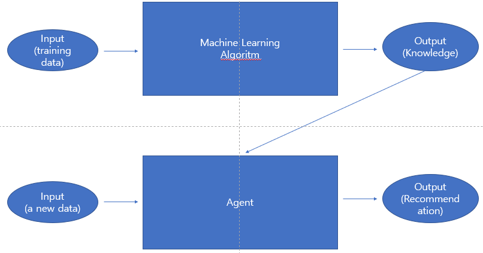

## Ubiquitous Computing Environment

이제 정말 많은 정보들이 언제, 어디서, 어느 시점이던 정보를 얻는 시대가 왔다.

데이터 생성, 그에 대한 이해관계

-> 구조적인 패턴을 찾는다(지능적으로 분석된 데이터)

Generalization(일반화)

## Data Mining

데이터들 사이에서 패턴을 찾는다.

> 패턴이란? 새로운 데이터에 대하여 실용적인 예측(구조적이다) 
데이터들을 종합해서 일반적인 규칙을 도출한 것

Toy Problem

-> 큰 문제를, 작은 영역으로 줄여놓은 것

Domain

-> Attributes(속성) & Class(or OutCome) , Instance(예제, 행)

> Instance는 n차원 공간에 표현되어야 한다.

-> 특정한, 관심있는 문제

-> MachineLearning에서 처리할 수 있는 형태로 문제를 만들어야 함

-> Modeling 필요

> Modeling이란? Machine Learning이 동작할 수 있게 입력된 형태로 만드는 것

## Incremental Machine Learning

 

Modeling한 데이터들을 Machine Learning에 넣고 나온 결과 값(Knowledge)을 Agent에 넣어준다.

그럼 이 Agent에는 Pattern이 있을 것이고, 새로운 데이터가 들어오더라도, 그에 상응하는 결과를 내놓게 된다.

이것을 Incremetal Machine Learning이라고 한다.

> 여기서 잠깐! 실생활에서는 다른 패턴이 나올 수 있다! 그것이 바로 Machine Error

## Attributes (속성)

속성에는 크게 2가지가 있다.

1. numeric (수치)

-> 온도, 습도 같이 상수로 표현되는 것들.
> ex) 97도

2. nominal (구간,category)

-> 특정한 구간값만 갖는다. 따라서, 조합의 개수를 얻을 수 있다.

> ex) Yes or No, High or Low

numeric만 필요한 알고리즘도 있고,

nominal만 필요한 알고리즘도 있다.

