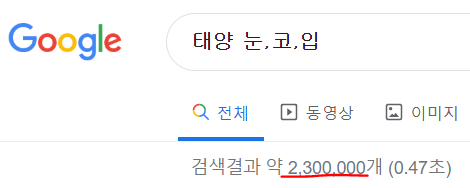

## Mustra

Music + Nostradamus = ***Mustra***

- Client로 부터 Input 을 받고, 그에 대해 음원 차트 페이지 '멜론' 에서 받을 수 있는 '좋아요👍' 수 를 예측하는 프로그램

- Mustra Homepage 👉 [Mustra Homepage](https://mustra-fan.github.io/)

### 사용 언어

Java, C#, Python 사용

## New Instance (Input)

1. SingerName

-> 가수의 이름

2. SongName

-> 노래 제목

3. FanNum

-> 멜론 팬 수

4. Video

-> 뮤직 비디오 유,무

SingerName과 SongName 을 Input 으로 받은 후에,

Chrome Web Browser 에서 Google 홈페이지를 접속 한 뒤

가수 이름 검색 결과 수

가수 + 노래 제목 검색 결과 수 (Ex. 태양 눈,코,입)

가수 + 기사 검색 결과 수

를 가져 온다(크롤링).

이를 토대로 학습된 Agent 에 새로운 Instance를 넣어서

'좋아요👍' 수를 예측 받는다.
